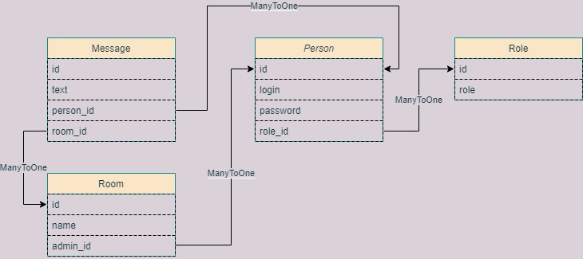

<h1>2. Создания чата на Rest API. [#9143]</h1>

1. Реализация REST Api через Spring Boot.  
2. Содержит четыре модели Person. Role. Room, Message.  
3. Приложение реализовывает чат c комнатами.  

<h3>Схема связей между таблицами</h3>

  
